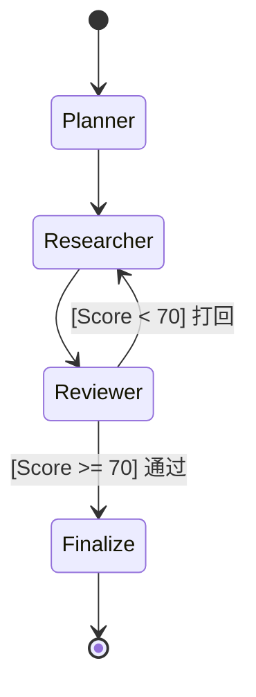

# framework 选择和架构

自框架(self-framework)/自软件(self-soft)时代可能要来了，就是尽量避免使用大型的工具和框架，而使用一些小型的，顶多使用一些定义了一些规范、最佳实践、难啃的骨头的小型工具集，
而不是框架，框架即死板也可能依赖lib过多，ai难以快速搞清楚使用关系，会迷失在依赖处理中，迷失在各种约束关系中，而小型的自包含的微型工具只完成一个领域的工作，剩余的扩展都有app自己完成，app自己定义风格，比如pi-tui完成了对终端的难搞的字符串编码为题，但它并没有设计为一种声名型框架，只是个命令型工具，我们可以直接用他的原始风格，也可以自包装为一个微型的声明型工具，比学习reactjs可能效果更好，app不需要满足其他开发者，只要按自己app需求定义框架效果即可。
再比如tailwindcss定义了成千上万的元素，我们平时用到的只有很少一部分，那未来的css框架应该是包含骨干定义和标准定义，剩余的自己用ai去扩展吧。
所以我们自己的框架也应该是尽量独立的、少文件甚至单文件的、不要有复杂依赖关系的。我们的自框架还应该考虑2层设计方式，一层是工具级的，能解决问题的，如果程序复杂了，再考虑进化到框架级的，规范性的。

## 主要参考

- [geminicli](https://geminicli.com)为例:
- [context7](https://context7.com/websites/geminicli)
- [deepwiki](https://deepwiki.com/google-gemini/gemini-cli)

## 状态机和workflow

- Moore 图：每个节点都是一个天然的 Span（追踪区间）。你可以清晰地看到：Writer 节点耗时 5s，Reviewer 节点耗时 2s。
- Mealy 图：如果逻辑都在“边”上，监控图会变成一团乱麻，你很难分清耗时到底是由于“状态转换逻辑”还是由于“动作执行过程”。

### 图格式mermaid

flowchart vs stateDiagram-v2

## TUI

布局参考: 
- https://mermaid.ai/open-source/syntax/block.html

### code agent cli

- cli
  - agent cli真正免费能打的就这几个：
    - geminicli 
    - codebuddy
    - qwen-code
  - 试用：
    - codex: 额度少
- 其他
  - [v0 by Vercel](https://v0.app)  

### tui lib

- [ink](https://github.com/vadimdemedes/ink)
- [opentui](https://github.com/anomalyco/opentui)
- [pi-tui](https://github.com/badlogic/pi-mono/tree/main/packages/tui)
- <https://github.com/RtlZeroMemory/Rezi>
  - c语言引擎，漂亮

### gen ui / agent ui

- **重要参考**
- [json-render](https://github.com/vercel-labs/json-render)  
- [Vercel AI SDK](https://vercel.com/docs/ai-sdk)  
- [CopilotKit](https://github.com/CopilotKit/CopilotKit)  
  - copilotkit generative-ui
    - <https://docs.copilotkit.ai/generative-ui>
    - <https://github.com/CopilotKit/generative-ui>
- [A2UI](https://github.com/google/A2UI)  
  - a2ui builder  <https://a2ui-composer.ag-ui.com/>  
- [LangChain Agent Chat UI](https://github.com/langchain-ai/agent-chat-ui)  

- **其他**
  - [Assistant UI](https://github.com/assistant-ui/assistant-ui)  
  - [Ant Design X](https://x.ant.design)  
  - [Stream Chat React AI SDK](https://getstream.io/chat/docs/sdk/react/guides/ai-integrations/stream-chat-ai-sdk)  
  - [Shadcn React AI 组件（AI Chat）](https://www.shadcn.io/ai)  

### 可观测性

- <http://logfire.pydantic.dev/docs/comparisons/langfuse/>

## workflow

- 命令型风格
  - 支持cli嵌入式风格lib引用
    - crewai.flow.flow 
      - 支持嵌入式风格cli程序
      - python @anno 风格
    - https://github.com/openworkflowdev/openworkflow
      -  OpenWorkflow Worker Separate Process
  - 依赖外部平台/服务，无法独立cli嵌入运行
    - [vercel Workflow ](https://useworkflow.dev/)
      - CLI + UI + OTel 类库化 vercel 的 nextjs绑定
    - [pydantic_graph](https://ai.pydantic.dev/api/pydantic_graph/graph/)
      - python 这个设计不错，命令式执行(类似applab思路)，不是先定义再执行
    - [Trigger.dev](https://trigger.dev)
      - TypeScript/JavaScript/Python, 基于云事件的无服务器工作流引擎，有 UI 控制台
      - Linux 的 CRIU (Checkpoint/Restore In Userspace) ，存储快照比较大（比如 200MB），冷启动慢
    - https://www.inngest.com/docs/getting-started/nodejs-quick-start
    - [temporalio/temporal](https://github.com/temporalio/temporal)
      - Go/Java/TS/Python/.NET 需部署 用法类似Workflow DevKit
    - https://github.com/PrefectHQ/prefect
      - python
  
- 声明型风格
  - LangGraph
    - [quickstart](https://docs.langchain.com/oss/python/langgraph/quickstart)
    - python/js
  - autogen.agentchat.group
    - python 
  - github action
    - yaml CICD
    - [probot/probot](https://github.com/probot/probot) 
      - typescript , github action的代码级封装
      - app.on("issues.opened", async (context) => {})

试验案例：
[trigger: translate-and-refine](https://trigger.dev/docs/guides/ai-agents/translate-and-refine) 这个案例再加个自动条件审核就足够测试各框架的api逻辑了

## 类似想法

- [ralph-tui](https://github.com/subsy/ralph-tui)
- <https://github.com/mikeyobrien/ralph-orchestrator>
  - 定位：改进版 Ralph Wiggum 技法的自主 AI 编排器，支持多 AI 后端，有交互式 TUI。

## doc确定性

下载同步: git clone依赖的原始项目
预处理：利用 Repomix 等工具将仓库“脱水”，剔除干扰，保留骨架。
符号化：利用 tree-sitter 等工具生成精确的符号表，作为 AI 的导航地图。
动态注入：不追求一次性处理所有代码，而是通过 LLM 编排，根据场景动态加载相关的代码片段。
标准化导航：在库中引入类似 llms.txt 的 AI 友好型说明文件，作为知识库的“高速缓存”。

### doc 确定性 ref
-  nodejs
  - `npm query`的解析器: <https://github.com/npm/cli/tree/latest/workspaces/arborist>