# Multi-Agent Development Flow

https://openworkflow.dev/docs/child-workflows

```typescript
import { defineWorkflow } from "openworkflow";

const generateReport = defineWorkflow(
  { name: "generate-report" },
  async ({ input, step }) => {
    const data = await step.run({ name: "fetch-data" }, async () => {
      return await db.reports.getData(input.reportId);
    });

    await step.run({ name: "upload-report" }, async () => {
      await storage.upload(`reports/${input.reportId}.pdf`, data);
    });

    return { reportUrl: `https://example.com/reports/${input.reportId}.pdf` };
  },
);

const processOrder = defineWorkflow(
  { name: "process-order" },
  async ({ input, step }) => {
    await step.run({ name: "charge-card" }, async () => {
      await payments.charge(input.orderId);
    });

    // Start the report workflow and wait for it to finish
    const report = await step.runWorkflow(generateReport.spec, {
      reportId: input.orderId,
    });

    await step.run({ name: "send-confirmation" }, async () => {
      await email.send({
        to: input.email,
        subject: "Order complete",
        body: `Your report is ready: ${report.reportUrl}`,
      });
    });
  },
);
```


## State Diagram

```mermaid
stateDiagram-v2
    direction LR
    [*] --> GoalDefined: User defines a goal
    GoalDefined --> Researching: Agent researches the problem space
    Researching --> Planning: Agent formulates a plan
    Planning --> Development: Agent implements the plan (in worktree/temp)
    Development --> Validating: Code is tested and verified
    Validating --> Reviewing: Changes are reviewed
    Reviewing --> Committing: Changes are committed
    Committing --> Merging: Changes are merged back to main
    Merging --> GoalAchieved: Goal is successfully completed
    GoalAchieved --> [*]: Process complete

    Validating --> Planning: Validation failed, refine plan
    Reviewing --> Development: Review feedback requires changes
    Development --> Researching: Fundamental issues found, requires re-research
```



## Flowchart

```mermaid
flowchart TD
    A[Start] --> B{Define Goal};
    B --> C[Research & Understand];
    C --> D[Formulate Plan];
    D --> E{Plan Approved?};
    E -- No --> D;
    E -- Yes --> F[Develop in Worktree/Temp];
    F --> G[Write Code & Tests];
    G --> H[Validate Changes (Tests, Linting)];
    H --> I{Validation Passed?};
    I -- No --> F;
    I -- Yes --> J[Code Review];
    J --> K{Review Approved?};
    K -- No --> F;
    K -- Yes --> L[Commit Changes];
    L --> M[Merge to Main];
    M --> N[Goal Achieved];
    N --> O[End];
```
