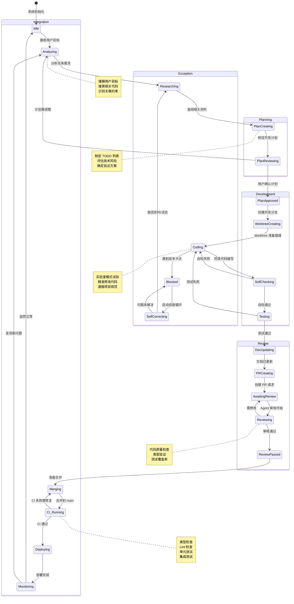
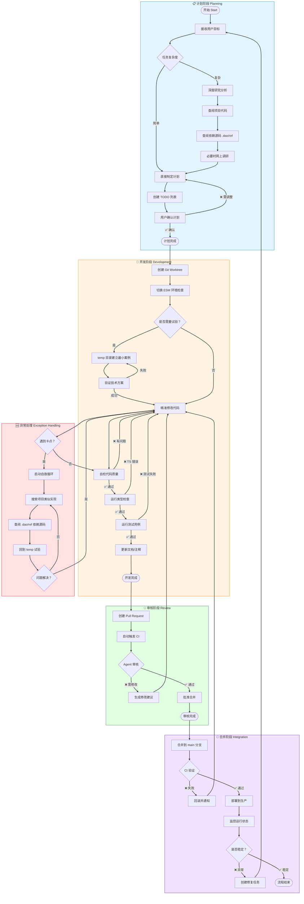

# 多 Agent 开发流程 (Multi-Agent Development Flow)

本文档描述了 DAO 项目中多 Agent 协作的完整开发流程，包括计划、Worktree 开发、审核、提交和合并回 main 等关键阶段。

## 状态图 (State Diagram)



## 流程图 (Flowchart)



## 关键节点说明 (Key Nodes Description)

### 1. 计划阶段 (Planning)

| 节点 | 职责 | 输出物 |
|------|------|--------|
| 接收用户目标 | 理解用户需求，识别核心目标 | 需求摘要 |
| 深度研究分析 | 分析技术可行性，识别风险点 | 风险评估报告 |
| 查阅相关资料 | 按优先级查阅：项目代码 → .dao/ref → node_modules → 网络 | 参考资料列表 |
| 创建 TODO 列表 | 拆解任务为可执行步骤 | TODO 列表 (todo_write) |
| 用户确认计划 | 与用户对齐预期，获取授权 | 用户确认记录 |

### 2. 开发阶段 (Development)

| 节点 | 职责 | 强制规范 |
|------|------|----------|
| 创建 Git Worktree | 隔离开发环境，避免污染主分支 | 分支命名规范 |
| ESM 环境检查 | 确认 package.json type: module | 模块系统验证 |
| 实验室模式 | 在 temp 目录试验，验证方案 | 最小可验证案例 |
| 精准修改代码 | 使用 replace 工具，避免大改 | 禁止 // ... rest of code |
| 自检代码质量 | 检查代码规范、逻辑完整性 | 自检清单 |
| 运行类型检查 | npx tsc --noEmit 或项目 check 脚本 | TS 验证通过 |
| 运行测试用例 | npm run test 或项目测试命令 | 测试覆盖率报告 |
| 更新文档/注释 | 同步更新相关文档和代码注释 | 文档变更记录 |

### 3. 审核阶段 (Review)

| 节点 | 检查项 | 通过标准 |
|------|--------|----------|
| 创建 Pull Request | 描述变更内容、关联 Issue | PR 模板完整 |
| 自动触发 CI | 类型检查、Lint、测试 | 全部绿色通过 |
| Agent 审核 | 代码质量、架构一致性、性能影响 | 审核清单通过 |
| 批准合并 | 确认无遗留问题 | 至少 1 个 Agent 批准 |

### 4. 合并阶段 (Integration)

| 节点 | 职责 | 回滚策略 |
|------|------|----------|
| 合并到 main | 执行 git merge/rebase | 保留完整历史 |
| CI 验证 | 最终集成测试 | 失败自动回滚 |
| 部署到生产 | 发布新版本/更新服务 | 灰度发布策略 |
| 监控运行状态 | 观察日志、指标、错误率 | 实时告警机制 |

### 5. 异常处理 (Exception Handling)

| 场景 | 响应动作 | 升级路径 |
|------|----------|----------|
| 技术卡点 | 启动自救循环 | 搜索 → 查阅 → 试验 |
| CI 失败 | 分析错误日志，定位问题 | 回滚 → 修复 → 重跑 |
| 测试失败 | 补充/修复测试用例 | 本地复现 → 修复 → 验证 |
| 类型错误 | 修正类型定义，禁止 as any | 查阅类型定义 → 修正 |
| 用户否定 | 重新理解需求，调整计划 | 沟通确认 → 重新规划 |

## 护栏与约束 (Guardrails & Constraints)

### 文件编辑约束

```json
{
  "protected_paths": [
    "config/evolution.json",
    "AGENTS.md",
    "package.json"
  ],
  "allowed_edit_roots": [
    "src/",
    "packages/",
    "tests/",
    "docs/",
    "temp/"
  ]
}
```

### 验证规范

1. **无验证，不交付**: 所有代码修改必须紧跟类型检查
2. **禁止 `as any`**: 除非用户明确授权
3. **最小化修改**: 每轮进化只包含最小可验证改动
4. **可观测性优先**: 优先增加日志、心跳或其他可观测手段

## 版本历史 (Version History)

| 版本 | 日期 | 变更内容 |
|------|------|----------|
| 1.0.0 | 2026-03-17 | 初始版本，定义完整多 Agent 开发流程 |
