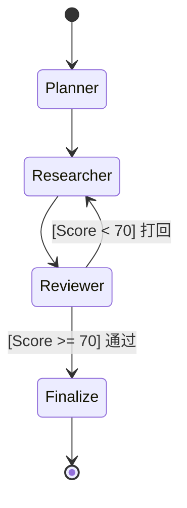

# framework 选择和架构

## 状态机和workflow

- Moore 图：每个节点都是一个天然的 Span（追踪区间）。你可以清晰地看到：Writer 节点耗时 5s，Reviewer 节点耗时 2s。
- Mealy 图：如果逻辑都在“边”上，监控图会变成一团乱麻，你很难分清耗时到底是由于“状态转换逻辑”还是由于“动作执行过程”。

### 图格式mermaid

## TUI

布局参考: 
- https://mermaid.ai/open-source/syntax/block.html
